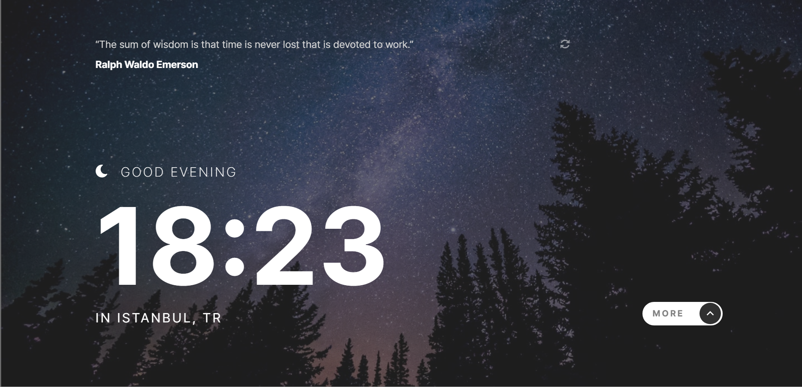
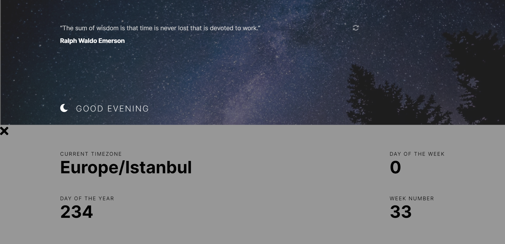

## Clock App

Used:

- [World Time Api](http://worldtimeapi.org/api/ip) to set the time based on the visitor's IP adress.
- [IP Geolocation API](https://freegeoip.app/) to set the city and country underneath the time.

### Expected Behaviour

- Change the greeting depending on the time of day. It should say:
  - "Good morning" between 5am and 12pm
  - "Good afternoon" between 12pm and 6pm
  - "Good evening" between 6pm and 5am
- Change the greeting icon and background image depending on the time of day. They should show:
  - The sun icon and the daytime background image between 5am and 6pm
  - The moon icon and the nighttime background image between 6pm and 5am
- Generate a new random programming quote whenever the refresh icon is clicked

